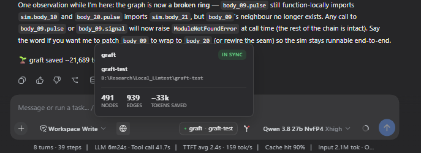
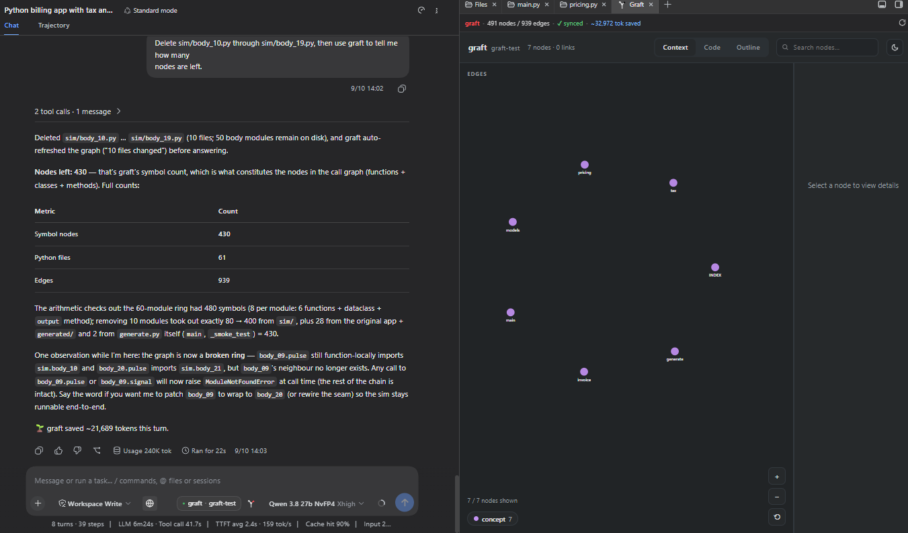
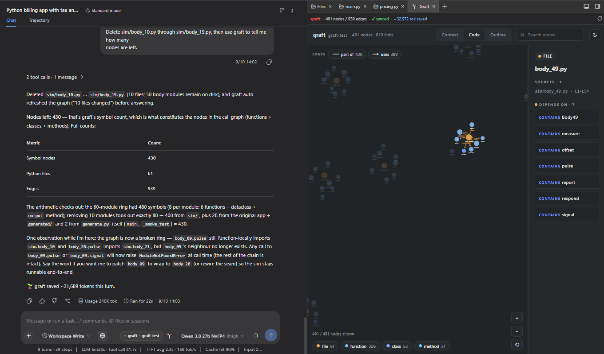

# dsh-graft-plugin

A [DeepSeek Harness](https://github.com/deepseek-ai/deepseek-harness) plugin that puts [graft](https://github.com/trailhq/Graft) — a prebuilt graph of every symbol, its `file:line` span, and who calls what — in front of both you and the model.

[View on GitHub](https://github.com/adithyanraj03/dsh-graft-plugin){: .btn }

---

## Install

```sh
dsh plugin --profile web add dsh-graft-plugin
dsh --profile web
```

The install puts the graft CLI on your PATH as well. Then index a repo once:

```sh
cd <your repo>
graft build
```

That is the whole setup. The chip appears in the composer and the model gets the tools.

---

## What it does

### Names the graph you are actually on

A chip beside the model name, resolved from **the session's workspace** rather than from wherever dsh was launched:

```
● graft · my-repo      in sync
◐ graft · my-repo      syncing
▲ graft · my-repo      stale
```



This is the reason the plugin exists rather than the `graft mcp` server. `graft mcp` resolves its repo once, from its own working directory at startup, and nothing can re-point it afterwards. Launched from a home directory it answers *"no graph found"* for every workspace you open — while the CLI, run in the same repo, answers fine.

### Gives the model five tools

| tool | what it answers |
|---|---|
| `graft_ask` | "how does X work" / "where is Y" — ranked hits, code inlined at exact `file:line` |
| `graft_grep` | every occurrence, grouped by enclosing symbol |
| `graft_callers` | who calls it, what it calls, the blast radius before a rename |
| `graft_skeleton` | a file's whole API in ~200 tokens |
| `graft_map` | orientation in an unfamiliar tree |

Each is resolved per session, so one dsh can serve several workspaces at once.

None of them take a boolean parameter — they take string enums, which reads better to a model and avoids a real failure mode on some OpenAI-compatible servers where a call that *sets* a boolean is emitted as literal `<tool_call>` text and never runs.

### Keeps the index current

`/graft` builds or rebuilds on demand. After the model edits files the index rebuilds in the background, debounced so a long turn does not rebuild constantly. It reuses graft's own sync runner, so it cannot drift from what `graft build` does.

### Draws the graph

A `graft viz` button opens the visualiser as a tab inside [dsh-better-sidebar](https://github.com/omdsh-dev/DSH-better-sidebar), if you have it mounted.



The code view drills into a single file — what it contains, what it depends on, what depends on it:



---

## Configuration

On the plugin's row in your profile's `cordis.patch.yml` — all optional:

```yaml
- id: graft-status
  name: 'dsh-graft-plugin'
  config:
    cwd: 'C:/path/to/repo'   # pin to one repo instead of resolving per session
    tools: false             # drop the graft_* tools, keep the chip
    command: false           # drop /graft
    promptSection: false     # stop telling the model to prefer graft
    autoBuild: false         # stop rebuilding after edits
```

---

## Requirements

- dsh `0.1.2-rc.1` or newer, web profile
- Node 22+
- the `graft` CLI on PATH — installed for you, or `npm install -g @nanonets/graft`

---

Licensed MIT. Issues and pull requests at [github.com/adithyanraj03/dsh-graft-plugin](https://github.com/adithyanraj03/dsh-graft-plugin).
